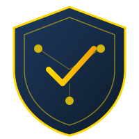

# CIVIUM

<p align="center">
  
</p>

<p align="center">
  <strong>Compliance Intelligence Substrate · Zuup World Model Node</strong><br>
  <em>"Compliance state, causally wired to the world."</em>
</p>

<p align="center">
  <a href="#overview">Overview</a> •
  <a href="#zwm-integration">ZWM Integration</a> •
  <a href="#architecture">Architecture</a> •
  <a href="#getting-started">Getting Started</a> •
  <a href="#api-reference">API Reference</a>
</p>

<p align="center">
  
  
  
  
  
</p>

---

## Overview

**CIVIUM** is the compliance intelligence substrate of the Zuup World Model (ZWM). It evaluates entity compliance status across regulatory domains (halal, ESG, ITAR) and participates as a causally-connected node in the ZWM graph.

Within the ZWM:
- Civium **emits** `ComplianceStateChange` events (Anchor program, Solana devnet)
- Civium state is stored as `ComplianceState` nodes in the shared Neo4j graph
- A `VIOLATION` status triggers causal propagation to Aureon (FitIQ penalty) and ZUSDC (settlement flag)

### Core Services

| Service | Port | Purpose |
|---------|------|---------|
| `compliance_graph` | 8003 | Neo4j graph engine — regulatory mapping, gap analysis, conflict detection |
| `entity_assessment` | 8002 | Entity scoring, compliance tier assignment |
| `regulatory_intelligence` | 8001 | Regulation scraping, NLP extraction (Federal Register, EUR-Lex) |
| `verification` | 8004 | Zero-knowledge proof generation and verification |
| `monitoring` | 8005 | Event streaming, metrics, audit logs |

---

## ZWM Integration

Civium is the **Phase 2A priority node** — the first platform to emit on-chain events for ZWM ingestion. Its binary compliance state (COMPLIANT / VIOLATION / FLAGGED) is the easiest to trigger manually for green-path validation.

### Emit side (Solana Anchor)

Program ID: `H1eSx6ij1Q296Tzss62AHuamn1rD4a9MkDapYu1CyvVM` (devnet)

```rust
#[event]
pub struct ComplianceStateChange {
    pub entity_id: String,
    pub status: String,       // "COMPLIANT" | "VIOLATION" | "FLAGGED"
    pub score: u8,
    pub domain: String,       // "halal" | "esg" | "itar"
    pub evidence_hash: [u8; 32],
    pub timestamp: i64,
}
```

**Instructions:**
- `evaluate_compliance(entity_id, status, score, domain, evidence_hash)` — creates PDA + emits event
- `update_compliance(status, score, domain, evidence_hash)` — updates PDA + emits event

**PDA:** `["compliance", entity_id]`

### Causal rules triggered by Civium

| Rule | Condition | Effect | Target |
|------|-----------|--------|--------|
| `civium-violation-aureon` | `status === 'VIOLATION'` | `RECALCULATE_FIT_IQ` (40% penalty) | aureon |
| `civium-violation-zusdc` | `status === 'VIOLATION'` | `FLAG_SETTLEMENT` | zusdc |

### Build the IDL

```bash
cd civium
anchor build
# Copy IDL to ZWM indexer after build
cp target/idl/civium.json ../zuup-zwm-indexer/idl/civium.json
```

---

## Architecture

```
┌──────────────────────────────────────────────────────────────────┐
│                          CIVIUM                                   │
├──────────────────────────────────────────────────────────────────┤
│                                                                    │
│  ┌─────────────────────┐   ┌──────────────────────────────────┐   │
│  │  Anchor Program     │   │  Python Microservices            │   │
│  │  programs/civium/   │   │                                  │   │
│  │  evaluate_compliance│   │  compliance_graph  (Neo4j)       │   │
│  │  update_compliance  │   │  entity_assessment (scoring)     │   │
│  │  emit! → ZWM        │   │  regulatory_intelligence (NLP)   │   │
│  └─────────────────────┘   │  verification      (ZK proofs)   │   │
│                             │  monitoring        (observ.)     │   │
│  ┌─────────────────────┐   └──────────────────────────────────┘   │
│  │  ZK Prover (Rust)   │                                           │
│  │  crates/zk-prover/  │   ┌──────────────────────────────────┐   │
│  │  Groth16 + Poseidon │   │  Shared Infrastructure           │   │
│  └─────────────────────┘   │  PostgreSQL · Redis · MongoDB    │   │
│                             │  Neo4j · Kafka · InfluxDB        │   │
│                             └──────────────────────────────────┘   │
│                                                                    │
└────────────────────────────────┬─────────────────────────────────┘
                                 │
                       ┌─────────▼──────────┐
                       │  ZWM Indexer       │
                       │  Solana onLogs →   │
                       │  Neo4j · GraphQL   │
                       └────────────────────┘
```

### Technology Stack

| Layer | Technology |
|-------|------------|
| On-chain | Solana Anchor 0.30.1 (devnet) |
| ZK Proofs | Rust, arkworks (Groth16), circom |
| Services | Python 3.11, FastAPI |
| Graph DB | Neo4j 5.x |
| Message Bus | Kafka |
| Cache | Redis 7 |
| Databases | PostgreSQL, MongoDB |

---

## Getting Started

### Prerequisites

- Anchor CLI 0.30.1, Rust 1.75+
- Python 3.11+
- Docker & Docker Compose
- Solana CLI (devnet configured)

### Start Infrastructure

```bash
cd civium
docker-compose up -d   # postgres, neo4j, mongodb, redis, kafka
```

### Build and Deploy Anchor Program

```bash
anchor build
anchor deploy --provider.cluster devnet
# Copy IDL to ZWM indexer after build
cp target/idl/civium.json ../zuup-zwm-indexer/idl/civium.json
```

### Run Services

```bash
cd services/entity_assessment && uvicorn main:app --port 8002
cd services/compliance_graph  && uvicorn main:app --port 8003
```

---

## API Reference

### Compliance Graph (port 8003)

```
GET  /compliance/status/{entity_id}
POST /compliance/gap-analysis
GET  /entities/{entity_id}/requirements
POST /ingestion/batch
```

### Entity Assessment (port 8002)

```
GET  /entities
POST /entities
GET  /assessments/{entity_id}
POST /scores/calculate
GET  /tiers/{entity_id}
```

### Verification (port 8004)

```
POST /verify/proof
POST /generate/credential
GET  /credentials/{entity_id}
```

---

## Repository Structure

```
civium/
├── programs/civium/            ← Anchor program (ZWM emit)
│   └── src/lib.rs              ← ComplianceStateChange event
├── crates/zk-prover/           ← Rust ZK proof library (Groth16)
├── circuits/                   ← Circom ZK circuits
├── contracts/                  ← Solidity (EVM mirror, optional)
├── services/
│   ├── compliance_graph/       ← Neo4j compliance engine
│   ├── entity_assessment/      ← Entity scoring & tiers
│   ├── regulatory_intelligence/← Regulation NLP pipeline
│   ├── verification/           ← ZK proof verification
│   └── monitoring/             ← Observability & audit logs
├── shared/                     ← Auth, DB clients, LLM, ZK utils
├── infrastructure/
│   ├── k8s/                    ← Kubernetes manifests (5 core services)
│   ├── terraform/              ← AWS EKS
│   └── docker/                 ← DB init scripts
├── Anchor.toml
├── Cargo.toml                  ← Workspace root
└── docker-compose.yml
```

---

## Status

### Completed
- [x] Compliance graph engine (Neo4j)
- [x] Entity assessment service (scoring, tiers)
- [x] Regulatory intelligence NLP pipeline
- [x] ZK proof verification service
- [x] Monitoring & audit logging
- [x] Anchor program — `ComplianceStateChange` event + instructions
- [x] `Anchor.toml` + workspace `Cargo.toml`

### In Progress (ZWM Phase 2A)
- [ ] `anchor build` → IDL → `zuup-zwm-indexer/idl/civium.json`
- [ ] Devnet deployment + green-path e2e test

### Roadmap
- Mainnet deployment (post security audit)
- W3C VC 2.0 credential issuance
- EPCIS 2.0 supply chain events

---

## License

Copyright © 2025 Visionblox LLC / Zuup Innovation Lab. All rights reserved.

---

<p align="center">
  <strong>CIVIUM</strong> — Compliance Substrate · Zuup World Model<br>
  <em>Zuup Innovation Lab · Huntsville, Alabama</em>
</p>
